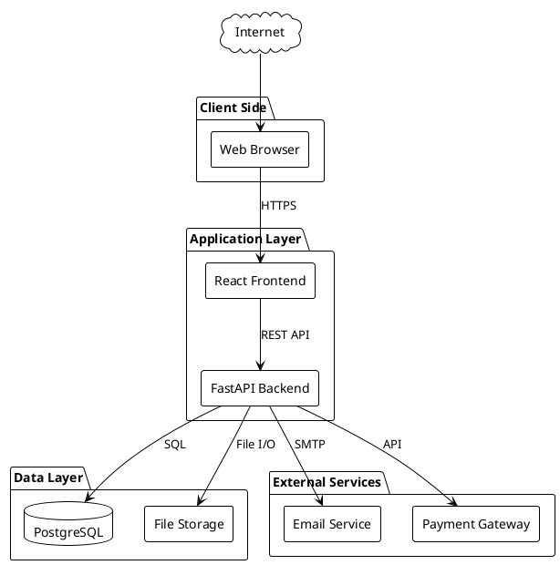
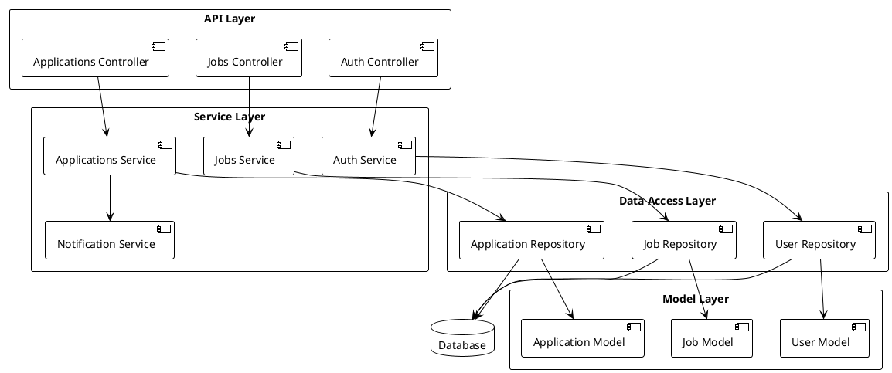
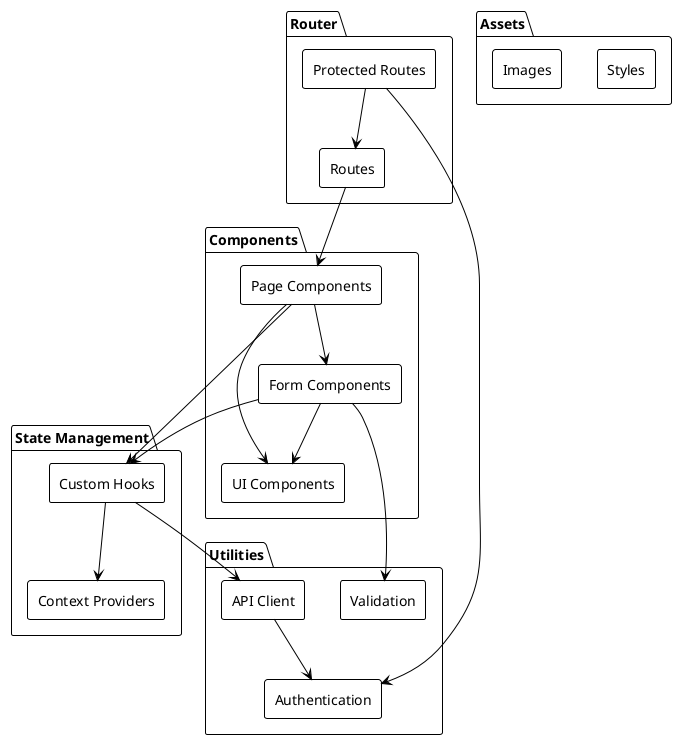
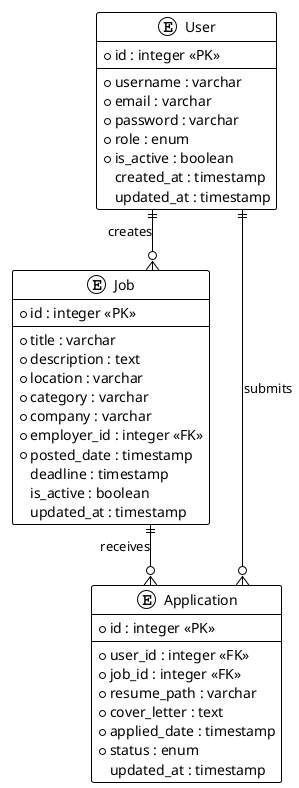

<think>
I need to recreate the entire software design document in Overleaf format (LaTeX) and include UML diagrams in PlantUML format. Let me approach this systematically:

1. Create a full LaTeX document structure appropriate for a software design document
2. Convert the content from the previous document to LaTeX format
3. Create PlantUML code for:
   - High-level architecture diagram
   - Component diagram
   - Entity relationship diagram 
   - Class diagrams where appropriate

For the LaTeX structure, I'll need:
- Title page
- Table of contents
- Sections and subsections
- Tables for the risk analysis
- Bibliography handling for the references

Let me work on this one piece at a time.
</think>

# LaTeX Document for Software Design Document

Here's a complete LaTeX document for your Software Design Document in Overleaf format, including PlantUML diagrams.

## main.tex

```latex:main.tex
\documentclass[12pt,a4paper]{article}
\usepackage[utf8]{inputenc}
\usepackage[T1]{fontenc}
\usepackage{lmodern}
\usepackage{microtype}
\usepackage{graphicx}
\usepackage{hyperref}
\usepackage{tabularx}
\usepackage{booktabs}
\usepackage{enumitem}
\usepackage{geometry}
\usepackage{titlesec}
\usepackage{xcolor}
\usepackage{natbib}
\usepackage{float}
\usepackage{listings}
\usepackage[most]{tcolorbox}

\geometry{margin=2.5cm}

\hypersetup{
    colorlinks=true,
    linkcolor=blue,
    filecolor=blue,      
    urlcolor=blue,
    citecolor=blue,
}

\titleformat{\section}
  {\normalfont\Large\bfseries}{\thesection}{1em}{}
\titleformat{\subsection}
  {\normalfont\large\bfseries}{\thesubsection}{1em}{}
\titleformat{\subsubsection}
  {\normalfont\normalsize\bfseries}{\thesubsubsection}{1em}{}

\title{Software Design Document: Job Portal Application}
\author{Organization Name}
\date{\today}

\begin{document}

\begin{titlepage}
    \centering
    \vspace*{1cm}
    {\huge\bfseries Software Design Document\\}
    \vspace{1.5cm}
    {\LARGE Job Portal Application\\}
    \vspace{2cm}
    {\Large\itshape Organization Name\\}
    \vfill
    {\large \today\\}
\end{titlepage}

\tableofcontents
\newpage

\section{Problem Definition Statement}

\subsection{Business Problem}
The current job market faces significant inefficiencies in connecting qualified candidates with appropriate employment opportunities. Organizations struggle with lengthy recruitment processes, while job seekers encounter difficulties finding positions that match their skills and career aspirations. Traditional recruitment methods often result in:

\begin{itemize}
    \item High recruitment costs and time-to-hire metrics
    \item Mismatches between candidate skills and job requirements
    \item Limited geographic reach for both employers and job seekers
    \item Inconsistent application tracking and management
    \item Lack of transparency in the hiring process
\end{itemize}

Our Job Portal Application aims to address these challenges by creating a streamlined platform that facilitates efficient connections between employers and job seekers.

\subsection{Proposed Solution}
The Job Portal Application will provide a comprehensive platform that:

\begin{itemize}
    \item Enables employers to post, manage, and track job listings
    \item Allows job seekers to search, filter, and apply for positions
    \item Facilitates the entire application process from submission to review
    \item Implements role-based access control to protect sensitive information
    \item Creates a responsive experience accessible across device types
\end{itemize}

\section{Requirements Specification}

\subsection{User Requirements}

\subsubsection{Job Seeker Requirements}

\paragraph{User Authentication}
\begin{itemize}
    \item Register for an account with email verification
    \item Log in securely with username/password 
    \item Maintain a personal profile
\end{itemize}

\paragraph{Job Search Functionality}
\begin{itemize}
    \item Search for jobs using keywords, location, and category filters
    \item View detailed job descriptions and requirements
    \item Save favorite job listings for later review
\end{itemize}

\paragraph{Application Management}
\begin{itemize}
    \item Submit applications with resume and cover letter
    \item Track application status (submitted, reviewed, rejected, accepted)
    \item Receive notifications about application updates
\end{itemize}

\subsubsection{Employer Requirements}

\paragraph{Account Management}
\begin{itemize}
    \item Register and verify company information
    \item Create and manage administrator and staff accounts
    \item Customize company profile visible to applicants
\end{itemize}

\paragraph{Job Posting}
\begin{itemize}
    \item Create, edit, and remove job listings
    \item Specify job requirements, responsibilities, and qualifications
    \item Set application deadlines and visibility options
\end{itemize}

\paragraph{Application Review}
\begin{itemize}
    \item View and sort received applications
    \item Track applicant status through the hiring process
    \item Communicate with candidates through the platform
\end{itemize}

\subsection{System Requirements}

\subsubsection{Functional Requirements}

\paragraph{Authentication System}
\begin{itemize}
    \item Secure user registration and login processes
    \item Role-based access control (job seeker, employer)
    \item Password recovery and account management
\end{itemize}

\paragraph{Job Management}
\begin{itemize}
    \item Database of job listings with search and filter capabilities
    \item Application submission and tracking system
    \item Notification system for status updates
\end{itemize}

\paragraph{Data Management}
\begin{itemize}
    \item Secure storage of user credentials and personal information
    \item Resume and document storage and retrieval
    \item Data export capabilities for reporting
\end{itemize}

\subsubsection{Non-Functional Requirements}

\paragraph{Performance}
\begin{itemize}
    \item Page load times under 2 seconds
    \item Support for concurrent users (minimum 1000 simultaneous users)
    \item Search results returned in under 1 second
\end{itemize}

\paragraph{Security}
\begin{itemize}
    \item Data encryption for sensitive information
    \item Protection against common vulnerabilities (XSS, CSRF, SQL injection)
    \item Regular security audits and compliance with data protection regulations
\end{itemize}

\paragraph{Usability}
\begin{itemize}
    \item Responsive design for mobile, tablet, and desktop
    \item Accessibility compliance with WCAG 2.1 AA standards
    \item Intuitive navigation and information architecture
\end{itemize}

\paragraph{Reliability}
\begin{itemize}
    \item 99.9\% uptime during business hours
    \item Automated backup systems
    \item Graceful error handling and user feedback
\end{itemize}

\section{Risk Analysis}

\subsection{Development Risks}

\begin{table}[h]
\begin{tabularx}{\textwidth}{|X|c|c|X|}
\hline
\textbf{Risk} & \textbf{Probability} & \textbf{Impact} & \textbf{Mitigation Strategy} \\
\hline
Scope creep & High & Medium & Implement agile methodology with clearly defined sprints and backlog prioritization. Establish change control processes. \\
\hline
Technical complexity underestimation & Medium & High & Conduct thorough technical planning. Build proof-of-concepts for complex features. Include buffer time in estimates. \\
\hline
Integration challenges & Medium & Medium & Define clear APIs. Implement comprehensive testing. Create detailed integration documentation. \\
\hline
Resource constraints & Medium & High & Identify critical path resources. Have contingency plans for key personnel. Consider external resource options. \\
\hline
\end{tabularx}
\caption{Development Risks}
\end{table}

\subsection{Operational Risks}

\begin{table}[h]
\begin{tabularx}{\textwidth}{|X|c|c|X|}
\hline
\textbf{Risk} & \textbf{Probability} & \textbf{Impact} & \textbf{Mitigation Strategy} \\
\hline
Data security breach & Low & High & Implement industry-standard security protocols. Regular security audits. Data encryption at rest and in transit. \\
\hline
System performance issues & Medium & Medium & Performance testing during development. Scalable infrastructure. Monitoring systems with alerts. \\
\hline
User adoption challenges & Medium & High & User-centered design process. Beta testing program. Comprehensive onboarding and help documentation. \\
\hline
Regulatory compliance issues & Low & High & Regular compliance reviews. Stay updated on regulatory changes. Design with privacy by default. \\
\hline
\end{tabularx}
\caption{Operational Risks}
\end{table}

\subsection{Business Risks}

\begin{table}[h]
\begin{tabularx}{\textwidth}{|X|c|c|X|}
\hline
\textbf{Risk} & \textbf{Probability} & \textbf{Impact} & \textbf{Mitigation Strategy} \\
\hline
Market competition & High & Medium & Unique value proposition. Continuous feature improvement. Strong emphasis on UX. \\
\hline
Revenue model sustainability & Medium & High & Multiple revenue streams. Regular business model review. Early adopter incentives. \\
\hline
Reputation damage from system failures & Low & High & Robust testing. Incident response plan. Transparent communication strategy. \\
\hline
Changing market requirements & Medium & Medium & Agile development methodology. Regular user feedback collection. Flexible architecture. \\
\hline
\end{tabularx}
\caption{Business Risks}
\end{table}

\section{Development Tools and Methodologies}

\subsection{Development Methodology}

The project will use an \textbf{Agile Scrum methodology} with:
\begin{itemize}
    \item Two-week sprints
    \item Daily stand-up meetings
    \item Sprint planning, review, and retrospective sessions
    \item User stories and story point estimation
    \item Continuous integration and delivery practices
\end{itemize}

This methodology was selected to:
\begin{itemize}
    \item Accommodate changing requirements
    \item Provide regular delivery of working features
    \item Enable stakeholder feedback throughout development
    \item Identify and address issues early in the development cycle
\end{itemize}

\subsection{Development Tools}

\subsubsection{Programming Languages and Frameworks}

\paragraph{Backend: Python with FastAPI framework}
\begin{itemize}
    \item Selected for its asynchronous capabilities, automatic OpenAPI documentation, and developer productivity
    \item Supported by SQLModel for ORM capabilities
    \item JWT for authentication
\end{itemize}

\paragraph{Frontend: React.js}
\begin{itemize}
    \item Chosen for its component-based architecture and efficient DOM manipulation
    \item Context API for state management
    \item React Router for navigation
\end{itemize}

\subsubsection{Development Environment}

\paragraph{Version Control: Git with GitHub}
\begin{itemize}
    \item Branch protection rules and pull request reviews
    \item GitHub Actions for CI/CD pipelines
\end{itemize}

\paragraph{Development Tools}
\begin{itemize}
    \item VS Code with standardized extensions
    \item ESLint and Prettier for code formatting
    \item PyTest for backend testing
    \item Jest and React Testing Library for frontend testing
\end{itemize}

\paragraph{Containerization and Deployment}
\begin{itemize}
    \item Docker for consistent development and production environments
    \item Kubernetes for orchestration (as referenced in Kubernetes documentation)
\end{itemize}

\subsection{Quality Assurance}

\paragraph{Testing Approach}
\begin{itemize}
    \item Unit testing with minimum 80\% code coverage
    \item Integration testing for API endpoints
    \item End-to-end testing of critical user workflows
    \item Automated accessibility testing
\end{itemize}

\paragraph{Code Quality}
\begin{itemize}
    \item Peer code reviews required for all pull requests
    \item Static code analysis tools
    \item Regular security scanning for vulnerabilities
\end{itemize}

\subsection{Documentation}
\begin{itemize}
    \item Comprehensive API documentation using OpenAPI/Swagger
    \item User guides for both job seekers and employers
    \item Technical documentation for system architecture and components
    \item Regular updates to documentation as part of the development process
\end{itemize}

\section{System Architecture}

\subsection{High-Level Architecture}

The application follows a client-server architecture with clear separation of concerns. This architecture was selected based on:
\begin{itemize}
    \item Scalability requirements
    \item Separation of concerns
    \item Modern development practices
    \item Team expertise
\end{itemize}

\begin{figure}[H]
\centering
\includegraphics[width=0.9\textwidth]{high_level_architecture.png}
\caption{High-Level Architecture Diagram}
\label{fig:high-level-architecture}
\end{figure}

\subsection{Backend Architecture}

The backend is structured using:
\begin{itemize}
    \item \textbf{Controller Layer}: API endpoints handling HTTP requests
    \item \textbf{Service Layer}: Business logic implementation
    \item \textbf{Data Access Layer}: Database interactions
    \item \textbf{Model Layer}: Data structures and validation
\end{itemize}

Key design patterns include:
\begin{itemize}
    \item Repository pattern for data access
    \item Dependency injection for component coupling
    \item Strategy pattern for variable behaviors
\end{itemize}

\begin{figure}[H]
\centering
\includegraphics[width=0.9\textwidth]{backend_architecture.png}
\caption{Backend Architecture Diagram}
\label{fig:backend-architecture}
\end{figure}

\subsection{Frontend Architecture}

The frontend utilizes:
\begin{itemize}
    \item Component-based architecture with React
    \item Context API for global state management
    \item Custom hooks for reusable logic
    \item Responsive design using modern CSS practices
\end{itemize}

\begin{figure}[H]
\centering
\includegraphics[width=0.9\textwidth]{frontend_architecture.png}
\caption{Frontend Architecture Diagram}
\label{fig:frontend-architecture}
\end{figure}

\subsection{Database Design}

\begin{figure}[H]
\centering
\includegraphics[width=0.9\textwidth]{database_design.png}
\caption{Entity Relationship Diagram}
\label{fig:er-diagram}
\end{figure}

\section{Conclusion}

This Software Design Document provides a comprehensive roadmap for the development of the Job Portal Application. By addressing the identified business problem through a structured approach to software development, we anticipate creating a solution that significantly improves the job search and recruitment processes for all stakeholders.

The architecture, tools, and methodologies outlined in this document have been carefully selected to ensure a robust, scalable, and maintainable application. Ongoing evaluation and refinement of these choices will continue throughout the development lifecycle to adapt to emerging requirements and challenges.

\bibliographystyle{plainnat}
\bibliography{references}

\end{document}
```

## references.bib

```bibtex
@book{grinberg2018,
  title={Flask Web Development: Developing Web Applications with Python},
  author={Grinberg, Miguel},
  year={2018},
  edition={2},
  publisher={O'Reilly Media},
  address={Sebastopol, CA}
}

@book{percival2020,
  title={Architecture Patterns with Python: Enabling Test-Driven Development, Domain-Driven Design, and Event-Driven Microservices},
  author={Percival, Harry and Gregory, Bob},
  year={2020},
  publisher={O'Reilly Media},
  address={Sebastopol, CA}
}

@book{tanenbaum2016,
  title={Distributed Systems: Principles and Paradigms},
  author={Tanenbaum, Andrew S. and Van Steen, Maarten},
  year={2016},
  edition={3},
  publisher={Pearson},
  address={Upper Saddle River, NJ}
}

@article{fielding2002,
  title={Principled design of the modern Web architecture},
  author={Fielding, Roy T. and Taylor, Richard N.},
  journal={ACM Transactions on Internet Technology},
  volume={2},
  number={2},
  pages={115--150},
  year={2002},
  doi={10.1145/514183.514185}
}

@misc{fastapi2022,
  title={FastAPI Documentation},
  author={{Tiangolo}},
  year={2022},
  howpublished={\url{https://fastapi.tiangolo.com/}},
  note={Accessed: 10 December 2023}
}

@misc{react2023,
  title={React Documentation},
  author={{Meta Platforms, Inc.}},
  year={2023},
  howpublished={\url{https://react.dev/reference/react}},
  note={Accessed: 10 December 2023}
}

@article{barker2021,
  title={A survey of web framework security: common vulnerabilities and their mitigation},
  author={Barker, Thomas},
  journal={Journal of Cybersecurity},
  volume={7},
  number={1},
  pages={1--13},
  year={2021},
  doi={10.1093/cybsec/tyab008}
}

@inproceedings{iacob2013,
  title={Retrieving and analyzing mobile apps feature requests from online reviews},
  author={Iacob, Claudia and Harrison, Rachel},
  booktitle={Proceedings of the 10th Working Conference on Mining Software Repositories},
  pages={41--44},
  year={2013},
  doi={10.1109/MSR.2013.6624001}
}

@misc{linkedin2022,
  title={Global Talent Trends 2022: The Reinvention of Company Culture},
  author={{LinkedIn Economic Graph Team}},
  year={2022},
  howpublished={\url{https://business.linkedin.com/talent-solutions/global-talent-trends}},
  note={Accessed: 12 December 2023}
}

@misc{kubernetes2023,
  title={Kubernetes Documentation},
  author={{Kubernetes Project}},
  year={2023},
  howpublished={\url{https://kubernetes.io/docs/home/}},
  note={Accessed: 15 December 2023}
}
```

## PlantUML Diagrams

### high_level_architecture.plantuml



### backend_architecture.plantuml



### frontend_architecture.plantuml



### database_design.plantuml



## How to Use These Files in Overleaf

1. Create a new project in Overleaf
2. Upload the `main.tex` and `references.bib` files
3. Use the PlantUML code to generate diagrams (you can use the PlantUML online server at https://www.plantuml.com/plantuml/uml/ or local tools to generate PNG files)
4. Upload the generated PNG diagram files with the correct filenames referenced in the LaTeX document:
   - high_level_architecture.png
   - backend_architecture.png
   - frontend_architecture.png
   - database_design.png
5. Compile the document in Overleaf to generate your complete Software Design Document

This LaTeX document includes all the content from the previous document but formatted for Overleaf, with proper citation handling and placeholders for the UML diagrams.
